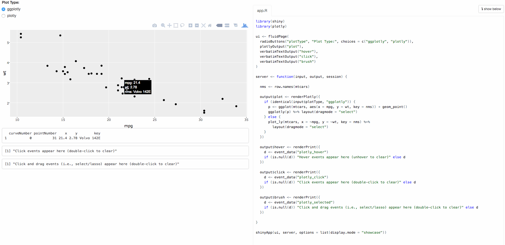
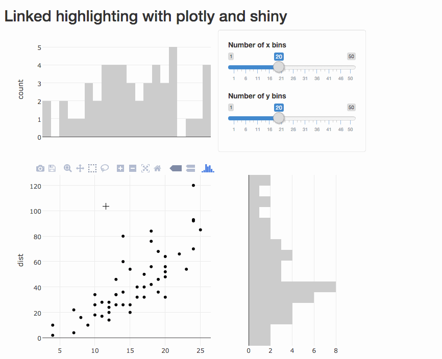
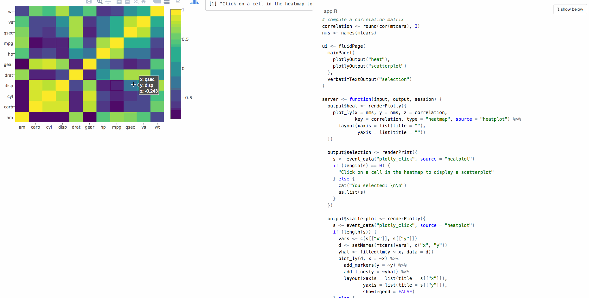
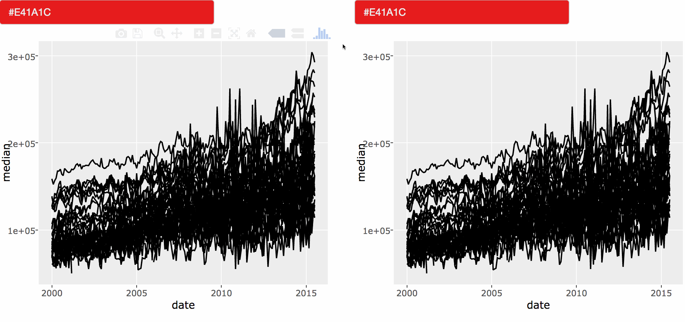

# Multiple linked views

## Linking views with shiny

### Accessing events in shiny

The plotly.js library emits custom events when a user interacts directly with a graph. The `event_data()` function provides a mechanism for accessing the data corresponding to those events within a shiny app. The shiny app in Figure \@ref(fig:plotlyEvents) is designed to demonstrate the most useful plotly events one may access via `event_data()`: mouse hover (`"plotly_hover"`), click (`"plotly_click"`), and click+drag (`"plotly_selected"`). All of these events return selections on the data scale, not on a pixel scale, which is useful for [updating views](#updating-views).

There are currently four different modes for click+drag interactions in plotly.js, but only two will trigger a `"plotly_selected"` event: rectangular and lasso selection. The other two drag modes, zoom and pan, both emit a `"plotly_relayout"` event which could be useful for say, providing global context in relation to a zoom event and/or recomputing a model based on new x/y limits. In Figure \@ref(fig:plotlyEvents), the default click+drag mode was set to rectangular selection set via the [dragmode](https://plot.ly/r/reference/#layout-dragmode) attribute, but the mode can also be changed interactively via the mode bar at the top of the graph.

The video in Figure \@ref(fig:plotlyEvents) helps demonstrate how different user events cause different blocks of code to be evaluated on the R server.^[You can also run the example yourself using the following code -- `shiny::runApp(system.file("examples", "plotlyEvents", package = "plotly"))`] Conceptually, you can think of events as different inputs that becomes invalidated when the event is triggered by plotly.js. Moreover, similar to restrictions placed on references to input value(s) in shiny, `event_data()` has to be called _within_ a reactive expressions. As RStudio's [lesson on reactive expressions](http://web.archive.org/web/20160405081516/http://shiny.rstudio.com/tutorial/lesson6/) points out: "A reactive expression is an R expression that uses widget input [(e.g., `event_data()`)] and returns a value."

Any of the `render*()` functions in **shiny** turn a regular R expression into a reactive expression. In Figure \@ref(fig:plotlyEvents), every use of `event_data()` appears within `renderPrint()` since we only need to display the result of the event on the user interface with `verbatimTextOutput()`. In the next section, we use the return result of `event_data()` to display more interesting and informative views of user events.

```{r plotlyEvents, echo=FALSE, fig.cap = "A video demonstration of plotly events in shiny. The video can be accessed [here](http://i.imgur.com/SJVIBvW.gif)"}

```

### Updating views

Obtaining data from a plotly event is easy, but updating view(s) based on the result of an event can be difficult. To start with something fairly easy, consider two scatterplots showing the same observations, but on different axes (i.e.., a subset of a scatterplot matrix). Figure \@ref(fig:plotlyLinkedBrushEasy) shows a linked lasso brush between two scatterplots. The main idea is that we first plot all the observations in black, then highlight the selection by adding an additional layer of selected points in red using the data returned by `event_data()`. In order to guarantee that we can uniquely identify observations in the event data, it is also crucial that we attach a `key` attribute to each observation (here the rownames of the data), which we can then use to filter the original data down to the selected observations. 

Figure \@ref(fig:plotlyLinkedBrushEasy) consciously updates the source of the selection (the top plot) to match the visual characteristics of the target (the bottom plot). In general, whenever linking views to display graphical selection(s), matching the visual characteristics of the selection both the source and target(s) can aide interpretation, especially when using interactive graphics to present results to others. Although the update rule in Figure \@ref(fig:plotlyLinkedBrushEasy) is to simply layer on additional points, a full redraw is performed during the update, which can impact performance when dealing with a large amount of graphical elements.

Figure \@ref(fig:plotlyLinkedBrushEasy) could be made slightly more efficient by just changing the color of selected points, or dimming the non-selected points, rather than plotting an extra layer of points. However, this technique does not work for chart types that display aggregate values (e.g., how do you dim non-selected values in a box plot?). For this reason, in [Linking views without shiny](#linking-views-without-shiny), selections are implemented as an additional layer, but avoid the full redraw required when updating plot via **shiny** reactive framework.^[To my knowledge, the **leaflet** package is the only R package which provides a way to update a plot in a shiny app without a full redraw.]

```{r plotlyLinkedBrushEasy, echo=FALSE, fig.cap = "A video demonstration of linked brushing in a shiny app. The video can be accessed [here](http://i.imgur.com/rUroUHT.gif) and the code to run the example is [here](https://gist.github.com/cpsievert/5934f173cafffb8dfb4f23d5488cd185)"}
knitr::include_graphics("images/plotlyLinkedBrushEasy.gif")
```

Since the update rule is the same for each view in Figure \@ref(fig:plotlyLinkedBrushEasy), we end up with a lot of redundant code that can be made more modular, as shown [here](https://gist.github.com/cpsievert/6fc17f4dc6d43c88dd214c12bb1a0324). Making code more modular not only makes for less reading, but it leaves you less prone to making mistakes. Since the only difference between the two plots is the x/y variables, we can write a function that accepts x/y variables as input, and output a plotly object. Since this function outputs a plotly object, and is dependent upon `event_data()`, which can only be called within a reactive expression, this function can only be called within the `renderPlotly()` function in the **plotly** package. 

```{r plotlyLinkedBrush, eval=FALSE, echo=FALSE, fig.cap = "Linked brushing between a scatterplot and marginal histograms."}

```

### Targeting views

The linked brushing example in Figure \@ref(fig:plotlyLinkedBrushEasy) has bi-directional communication -- a `"plotly_selected"` event deriving from either view impacts the other view. In other words, each view can be either the source or target of the selection. Often times, we want _one_ view to be the source of a selection, and related view(s) to be the target. Figure \@ref(fig:plotlyLinkedClick) shows a heatmap of a correlation matrix (the source of a selection) linked to a scatterplot (the target of a selection). By clicking on a cell in the correlation matrix, a scatterplot of the two variables is displayed below the matrix. 

To update the scatterplot view, Figure \@ref(fig:plotlyLinkedClick) accesses `"plotly_click"` events via the `event_data()` function, but it also careful to not access click events triggered from the scatterplot. By strategically matching the value of the `source` argument in the `plot_ly()` and `event_data()` functions, Figure \@ref(fig:plotlyLinkedClick) effectively restricts the scope of events to a specific plot (the heatmap).

```{r plotlyLinkedClick, echo=FALSE, fig.cap = "A video demonstration of clicking on a cell in a correlation matrix to view the corresponding scatterplot. The video can be accessed [here](http://i.imgur.com/2pNZejk.gif) and the code to run the example is [here](https://gist.github.com/cpsievert/ece4741967baf1840843ecc44c1bb677)"}

```

Another aspect of Figure \@ref(fig:plotlyLinkedClick) that makes it an interesting example is that the `key` attribute is a matrix, matching the same dimensions of `z` (i.e, the values displayed in each cell). For good reason, most linked views paradigms (including the paradigm discussed in [Linking views without shiny](#linking-views-without-shiny)) restrict linkage definitions to relational database schema. In this case, it is more efficient to implement the relation with a key matrix, rather than a column.

## Linking views without shiny

```{block, type='rmdwarning', include=knitr:::is_html_output()}
The code in this section is still under development and is likely to change.
To run any of the code you see in this section, you'll need this developmental version of the package:
`devtools::install_github("ropensci/plotly")`
```

<!-- TODO:
Explain again the importance of having standalone HTML?
-->

### Motivating examples

As shown in [Linking views with shiny](#linking-views-with-shiny), the `key` attribute provides a way to attach a key (i.e., ID) to graphical elements -- an essential feature when making graphical queries. When linking views in **plotly** outside of **shiny**, the suggested way to attach a key to graphical elements is via the `SharedData` class from the **crosstalk** package [@crosstalk]. At the very least, the `new()` method for this class requires a data frame, and a key variable. Lets suppose we're interested in making comparisons of housing sales across cities for a given year using the `txhousing` dataset. Given that interest, we may want to make graphical queries that condition on a year, so we start by creating a `SharedData` object with `year` as the shared key.

```{r, eval = FALSE}
# devtools::install_github("ropensci/crosstalk")
library(crosstalk)
sd <- SharedData$new(txhousing, ~year)
```

As far as `ggplotly()` and `plot_ly()` are concerned, `SharedData` object(s) act just like a data frame, but with a special `key` attribute attached to graphical elements. Since both interfaces are based on [the layered grammar of graphics](#the-layered-grammar-of-graphics), `key` attributes can be attached at the layer level, and those attributes can also be shared across multiple views. Figure \@ref(fig:linked-panels) leverages both of these features to link multiple views of median house sales in various Texan cities. As the [video](http://i.imgur.com/DdPdSBB.gif) shows, hovering over a line in any panel selects that particular year, and all corresponding panels update to highlight that year. The result is an incredibly powerful tool for quickly comparing house sale prices, not only across cities for a given year, but also across years for a given city.

```{r, eval = FALSE}
p <- ggplot(sd, aes(month, median)) +
  geom_line(aes(group = year)) + 
  geom_smooth(data = txhousing, method = "gam") + 
  facet_wrap(~ city)

ggplotly(p, tooltip = "year") %>%
  highlight(on = "plotly_click", defaultValues = 2015, color = "red")
```

```{r linked-panels, echo = FALSE, fig.cap = "Monthly median house sales by year and city. Each panel represents a city and panels are linked by year. A video demonstrating the graphical queries can be viewed [here](http://i.imgur.com/DdPdSBB.gif)"}
knitr::include_graphics("images/crosstalkLinkedPanels.gif")
```

<!-- TODO: talk more about the finding in the figure -->

Figure \@ref(fig:linked-panels) uses the `highlight()` function from the **plotly** package to specify the type of plotly event for triggering a selection (via the `on` argument), the color of the selection (via the `color` argument), and set a default selection (via the `defaultValues` argument). The `off` argument controls the type of event that clears selections, and by default, is set to a `plotly_relayout` event, which can be triggered by clicking the home icon in the mode bar (or via zoom/pan). The `highlight()` function can also be used to control [Transient versus persistent selection](#transient-versus-persistent-selection) modes, and dynamically control selection colors, which is very useful for making comparisons.

<!--
TODO: Talk about the convenience of having "standard" events generated across chart types. When working with something like D3, you typically have to bind to DOM elements when attaching listeners, which does not generalize well.
-->

Figure \@ref(fig:linked-ggally) shows another example of using `SharedData` objects to link multiple views, this time to enable linked brushing in a scatterplot matrix via the `ggpairs()` function from the **GGally** package. As discussed in [Scatterplot matrices](#scatterplot-matrices), the `ggpairs()` function implements the generalized pairs plot -- a generalization of the scatterplot matrix -- an incredibly useful tool for exploratory data analysis. Since the `Species` variable (as discrete variable) is mapped to color in Figure \@ref(fig:linked-ggally), we can inspect both correlations, and marginal densities, dependent upon Species type. By adding the brushing capabilities via `ggplotly()`, we add the ability to examine the dependence between a continuous conditional distribution and other variables. For this type of interaction, a unique key should be attached to each observation in the original data, which is the default behavior of the `SharedData` object's `new()` method when no key is provided.

```{r, eval = FALSE}
d <- SharedData$new(iris)
p <- GGally::ggpairs(d, aes(color = Species), columns = 1:4)
layout(ggplotly(p), dragmode = "select")
```

```{r linked-ggally, echo = FALSE, fig.cap = "Brushing a scatterplot matrix via the `ggpairs()` function in the **GGally** package. A video demonstrating the graphical queries can be viewed [here](http://i.imgur.com/dPTtH3H.gif)"}
knitr::include_graphics("images/plotlyGGally.gif")
```

When the graphical query is made is \@ref(fig:linked-ggally), the marginal densities do not update. This points out one of the weaknesses of implementing multiple linked views without shiny (or some other R backend). The browser knows nothing about the algorithm **GGally** (or **ggplot2**) uses to compute a density, so updating the densities in a consistent way is not realistic without being able to call R from the browser. It is true that we could try to precompute densities for every possible selection state, but this does not generally scale well when the number of selection states is large, even as large as Figure \@ref(fig:linked-ggally). As discussed briefly in [bars & histograms](#bars-histograms), [Boxplots](#boxplots), and [2D distributions](#2D-distributions), plotly.js does have some statistical functionality that we can leverage to display [Dynamic aggregates](#dynamic-aggregates), but this currently covers only a few types of statistical displays.

### Transient versus persistent selection

The examples in the previous section use transient selection, meaning that when a value is selected, previous selection(s) are forgotten. Sometimes it is more useful to allow selections to accumulate -- a type of selection known as persistent selection. To demonstrate the difference, Figure \@ref(fig:persistent) presents two different takes a single view, one with transient selection (on the left) and one with persistent selection (on the right). Both selection modes can be used when linking multiple views, but as Figure \@ref(fig:persistent) shows, highlighting graphical elements, even in a single view, can be useful tool to avoid overplotting. 

```{r, eval = FALSE}
sd <- SharedData$new(txhousing, ~city)
p <- ggplot(sd, aes(date, median)) + geom_line()
gg <- ggplotly(p, tooltip = "city")

highlight(gg, on = "plotly_hover", dynamic = TRUE)
highlight(gg, on = "plotly_hover", dynamic = TRUE, persistent = TRUE)
```

```{r persistent, echo = FALSE, fig.cap = "Highlighting lines with transient versus persistent selection. In the left hand panel, transient selection (the default); and in the right hand panel, persistent selection. The video may be accessed [here](http://i.imgur.com/WyBmdv3.gif)"}

```

Figure \@ref(fig:persistent) also sets the `dynamic` argument to `TRUE` to populate a widget, powered by the **colourpicker** package [@colourpicker], for dynamically altering the selection color. When paired with persistent selection, this makes for a powerful tool for making comparisons between two selection sets. However, for Figure \@ref(fig:persistent), transient selection is probably the better mode for an initial look at the data (to help reveal any structure in missingness or anomalies for a given city), whereas persistent selection is better for making comparisons once have a better idea of what cities might be interesting to compare.

### Linking with other htmlwidgets

Perhaps the most exciting thing about building a linked views framework on top of the **crosstalk** package is that it provides a standardized protocol for working with selections that other **htmlwidget** packages may build upon. If implemented carefully, this effectively provides a way to link views between two independent graphical systems -- a fairly foreign technique within the realm of interactive statistical graphics. This grants a tremendous amount of power to the analyst since she/he may leverage the strengths of multiple systems in a single linked views analysis. Figure \@ref(fig:leaflet) shows an example of linked views between plotly and leaflet for exploring the relationship between the magnitude and geographic location of earthquakes. 

```{r, eval = FALSE}
library(plotly)
library(leaflet)

sd <- SharedData$new(quakes)

p <- plot_ly(sd, x = ~depth, y = ~mag) %>% 
  add_markers(alpha = 0.5) %>%
  layout(dragmode = "select") %>%
  highlight(dynamic = TRUE, persistent = TRUE)

map <- leaflet(sd) %>% 
  addTiles() %>% 
  addCircles()

htmltools::tagList(p, map)
```

```{r leaflet, echo = FALSE, fig.cap = "Linking views between plotly and leaflet to explore the relation between magnitude and geographic location of earthquakes around Fiji. The video may be accessed [here](http://i.imgur.com/hd0tG0r.gif)"}
knitr::include_graphics("images/plotlyLeaflet.gif")
```

In Figure \@ref(fig:leaflet), the user first highlights earthquakes with a magnitude of 5 or higher in red (via plotly), then earthquakes with a magnitude of 4.5 or lower, and the corresponding earthquakes are highlighted in the leaflet map. This immediately reveals an interesting relationship in magnitude and geographic location, and leaflet provides the ability to zoom and pan on the map to investigate regions that have a high density of quakes. It's worth noting that the **crosstalk** package itself does not provide semantics for describing persistent/dynamic selections, but **plotly** does inform crosstalk about these semantics which other **htmlwidget** authors can access in their JavaScript rendering logic.

### Selection via indirect manipulation

The interactions described thus far in [Linking views without shiny](#linking-views-without-shiny) is what @ggobi:2007 calls direct manipulation, where the user makes graphical queries by directly interacting with graphical elements. In Figure \@ref(fig:indirect-manip), cities are queried indirectly via a dropdown powered by the selectize.js library [@selectizejs]. Indirect manipulation is especially useful when you have unit(s) of interest (e.g. your favorite city), but can not easily find that unit in the graphical space. The combination of direct and indirect manipulation is powerful, especially when the interactive widgets for indirect manipulation are synced with direct manipulation events. As shown in Figure \@ref(fig:indirect-manip), when cities are queried indirectly, the graph updates accordingly, and when cities are queried directly, the select box updates accordingly. If the time series was linked to other view(s), as it is in the next section, selecting a city via the dropdown menu would highlight all of the relevant view(s).

```{r, eval = FALSE}
# Group name is used to populate a title for the dropdown
sd <- SharedData$new(txhousing, ~city, group = "Choose a city")
plot_ly(sd, x = ~date, y = ~median) %>%
  add_lines(text = ~city, hoverinfo = "text") %>%
  highlight(on = "plotly_hover", persistent = TRUE, selectize = TRUE)
```

```{r indirect-manip, echo = FALSE, fig.cap = "Selecting cities by indirect manipulation. The video may be accessed [here]()"}
knitr::include_graphics("images/plotlySelectize.gif")
```

### The SharedData plot pipeline

Sometimes it is useful to display a summary (i.e., overview) in one view and link that summary to more detailed views. Figure \@ref(fig:bars-lines) is one such example that displays a bar chart of all Texan cities with one or more missing values (the summary) linked with their values over time (the details). By default, the bar chart allows us to quickly see which cities have the most missing values, and by clicking a specific bar, it reveals the relationship between missing values and time for a given city. In cities with the most missing values, data did not start appearing until somewhere around 2006-2010, but for most other cities (e.g., Harlingen, Galveston, Temple-Belton, etc), values started appearing in 2000, but for some reason go missing around 2002-2003.

```{r bars-lines, echo = FALSE, fig.cap = "A bar chart of cities with one or more missing median house sales linked to a time series of those sales over time. The video may be accessed [here](http://i.imgur.com/hzVe2FR.gif)"}
knitr::include_graphics("images/plotlyLinkedBars.gif")
```

When implementing linked views like Figure \@ref(fig:bars-lines), it can be helpful to conceptualize a pipeline between a central data frame and the corresponding views. Figure \@ref(fig:pipeline) is a visual depiction of this conceptual model between the central data frame and the eventual linked views in Figure \@ref(fig:bars-lines). In order to generate the bar chart on the left, the pipeline contains a function for computing summary statistics (the number of missing values per city). On the other hand, the time series does not require any summarization -- implying the pipeline for this view is the identity function.

```{r pipeline, echo = FALSE, fig.cap = "A diagram of the pipeline between the data and graphics."}
knitr::include_graphics("images/pipeline.png")
```

Since the pipeline from data to graphic is either an identity function or a summarization of some kind, it is good idea to use the most granular form of the data for the `SharedData` object, and use [the data-plot-pipeline](#the-data-plot-pipeline) to define a pipeline from the data to the plot. As @plumbing writes, a true interactive graphics system is aware of the both the function from the central data object to the graphic, as well as the inverse function (i.e., the function from the graphic back to the central data object). As it currently stands, **plotly** loses this information when the result is pushed to the web browser, but that does not matter for Figure \@ref(fig:bars-lines) since the pipeline does not need to re-execute statistical summaries of information tied to a user event.^[Since **dplyr** semantics translate to `SQL` primitives, you could imagine a system that translates a data-plot-pipeline to `SQL` queries, and dynamically re-executes within the browser via something like `SQL.js` [@SQLjs].]

```{r, eval = FALSE}
sd <- SharedData$new(txhousing, ~city)

base <- plot_ly(sd, color = I("black")) %>%
  group_by(city)

p1 <- base %>%
  summarise(has = sum(is.na(median))) %>%
  filter(has > 0) %>%
  arrange(has) %>%
  add_bars(x = ~has, y = ~factor(city, levels = city), 
           hoverinfo = "none") %>%
  layout(
    barmode = "overlay",
    xaxis = list(title = "Number of months missing"),
    yaxis = list(title = "")
  ) 

p2 <- base %>%
  add_lines(x = ~date, y = ~median, alpha = 0.3) %>%
  layout(xaxis = list(title = ""))

subplot(p1, p2, titleX = TRUE, widths = c(0.3, 0.7)) %>% 
  layout(margin = list(l = 120)) %>%
  highlight(on = "plotly_click", off = "plotly_unhover", color = "red")
```

### Dynamic aggregates

As discussed in the plotly cookbook, there are a number of way to compute statistical summaries in the browser via plotly.js (e.g., `add_histogram()`, `add_boxplot()`, `add_histogram2d()`, and `add_histogram2dcontour()`). When linking views with the __plotly__ package, we can take advantage of this functionality to display aggregated views of selections. Figure \@ref(fig:highlight-boxplot) shows a basic example of brushing a scatterplot to select cars with 10-20 miles per gallon, then a 5 number summary of the corresponding engine displacement is dynamically computed and displayed as a boxplot.

```{r highlight-boxplot-fake, eval = FALSE}
d <- SharedData$new(mtcars)
scatterplot <- plot_ly(d, x = ~mpg, y = ~disp) %>%
  add_markers(color = I("black")) %>%
  layout(dragmode = "select")

subplot(
  plot_ly(d, y = ~disp, color = I("black")) %>% 
    add_boxplot(name = "overall"),
  scatterplot, shareY = TRUE
) %>% layout(dragmode = "select")
```

```{r highlight-boxplot, echo = FALSE, fig.cap = "Dynamically populating a boxplot reflecting brushed observations"}
knitr::include_graphics("images/highlight-boxplot.gif")
```

Figure \@ref(fig:highlight-boxplot) is very similar to Figure \@ref(fig:highlight-bars), but uses `add_histogram()` to link to a bar chart of the number of cylinders rather than a boxplot of engine displacement. By brushing to select cars with a low engine displacement, we can see that (obviously) displacement is related with to the number of cylinders.

```{r highlight-bars-fake, eval = FALSE}
p <- subplot(
  plot_ly(d, x = ~factor(vs)) %>% add_histogram(color = I("black")),
  scatterplot
) 

# Selections are actually additional traces, and, by default, 
# plotly.js will try to dodge bars placed under the same category
layout(p, barmode = "overlay")
```

```{r highlight-bars, echo = FALSE, fig.cap = "Dynamically populating a bar chart reflecting brushed observations"}
knitr::include_graphics("images/highlight-bars.gif")
```

\newpage

### Nested selections

#### Grouped selections via `ggplotly()`

In statistical graphics, it is quite common for a graphical element to be tied to multiple observations. For example, a line representing the fitted values from a linear model is inherently connected to the observations used to fit the model. In fact, any graphical summary (e.g. boxplot, histogram, density, etc.) can be linked back the original data used to derive them. Especially when comparing multiple summaries, it can be useful to highlight group(s) of summaries, as well as the raw data that created them. Figure \@ref(fig:smooth-highlight) uses `ggplotly()`'s built-in support for linking graphical summaries with raw data to enable highlighting of linear models.^[Strictly speaking, as long as a key is provided to a **ggplot2** layer with a non-identity statistic, `ggplotly()` will nest keys within group.] Furthermore, notice how there are actually two levels of selection in Figure \@ref(fig:smooth-highlight) -- when hovering over a single point, just that point is selected, but when hovering over a fitted line, all the observations tied to that line are selected.

<!--
Figure \@ref(fig:bars-lines) is one such example where each bar (i.e., each city) is tied to multiple observations (i.e., monthly sales within city). In that example, the group and key variables are the same (`city`), but what happens when they are different? In the case that a key variable is _nested_ inside a **ggplot2** group, `ggplotly()` will automatically track each group.
-->

```{r smooth-highlight-fake, eval = FALSE}
# if you don't want to highlight individual points, you could specify
# `class` as the key variable here, instead of the default (rownames)
m <- SharedData$new(mpg)
p <- ggplot(m, aes(displ, hwy, colour = class)) +
    geom_point() +
    geom_smooth(se = FALSE, method = "lm")
ggplotly(p) %>% highlight("plotly_hover")
```

```{r smooth-highlight, echo = FALSE, fig.cap = "Engine displacement versus highway miles per gallon by class of car. The linear model for each class, as well as the individual observations, can be selected by hovering over the line of fitted values. An individual observation can also be selected by hovering over the relevant point."}
knitr::include_graphics("images/smooth-highlight.gif")
```

At first, it might not seem as though "nested" selections are that useful. After all, the highlighting of individual points in Figure \@ref(fig:smooth-highlight) does not supply us with any additional information. However, applying this same idea to multiple views of the same observations can be quite useful. Figure \@ref(fig:ggnostic) demonstrates a useful application via the `ggnostic()` function from the **GGally** package [@GGally]. This function produces a matrix of diagnostic plots from a fitted model object, with different diagnostic measures in each row, and different explanatory variables in each column. Figure \@ref(fig:ggnostic) shows the default display for a linear model, which includes residuals (`resid`), estimates of residual standard deviation when a particular observation is excluded (`sigma`), diagonals from the projection matrix (`hat`), and cooks distance (`cooksd`). 

```{r ggnostic-fake, eval = FALSE}
# for better tick labels
mtcars$am <- dplyr::recode(mtcars$am, `0` = "automatic", `1` = "manual")
# choose a model by AIC stepping backwards 
mod <- step(lm(mpg ~ ., data = mtcars), trace = FALSE)
# produce diagnostic plots, coloring by automatic/manual
pm <- GGally::ggnostic(mod, mapping = aes(color = am))
# ggplotly() automatically adds rownames as a key if none is provided
ggplotly(pm) %>% highlight("plotly_click")
```

```{r ggnostic, echo = FALSE, fig.cap = "Using nested selections to highlight numerous diagnostics from different regions of the design matrix."}
knitr::include_graphics("images/ggnostic.gif")
```

Injecting interactivity into `ggnostic()` via `ggplotly()` enhances the diagnostic plot in at least two ways. Coloring by a factor variable in the model allows us to highlight that region of the design matrix by selecting a relevant statistical summary, which can help avoid overplotting when dealing with numerous factor levels. For example, in Figure \@ref(fig:ggnostic), the user first highlights diagnostics for cars with manual transmission (in blue), then cars with automatic transmission (in red). Perhaps more widely useful is the ability to highlight individual observations since most of these diagnostics are designed to identify highly influential or unusual observations.

In Figure \@ref(fig:ggnostic), there is one observation with a noticeably high value of `cooksd`, which suggests the observation has a large influence on the fitted model. Clicking on that point highlights its corresponding diagnostic measures, plotted against each explanatory variable. Doing so makes it obvious that this observation is influential since it has a unusually high response/residual in a fairly sparse region of the design space (i.e., it has a pretty high value of `wt`) and removing it would significantly reduce the estimated standard deviation (`sigma`). By comparison, the other two observations with similar values of `wt` have a response value very close to the overall mean, so even though their value of `hat` is high, their value of `sigma` is low.

Highlighting groups via fitted lines is certainly useful, but it is not the only way to highlight groups via a graphical summary. In fact, anytime a key variable is supplied to **ggplot2** layer with a non-identity statistic, it automatically attaches all the unique key values tied to all the observations that went into creating the group -- enabling linked selections between raw and aggregated forms of the data. For example, Figure \@ref(fig:density2scatter) links several density estimates back to the original data, and by clicking on a particular density estimate, it highlights all of the observations associated with that group. Yet again, this is an effective strategy to combat overplotting by bring groups of interests to the foreground of the graphic.

```{r density2scatter-fake, eval = FALSE}
m <- SharedData$new(mpg)
p1 <- ggplot(m, aes(displ, fill = class)) + geom_density()
p2 <- ggplot(m, aes(displ, hwy, fill = class)) + geom_point()
subplot(p1, p2) %>% highlight("plotly_click") %>% hide_legend()
```

```{r density2scatter, echo = FALSE, fig.cap = "Clicking on a density estimate to highlight all the raw observations that went into that estimate."}
knitr::include_graphics("images/density2scatter.gif")
```


<!--
All of the sections under [linking views without shiny](#linking-views-without-shiny) thus far have attached a _single value_ to a graphical mark or group of marks. In mathematical terms, this implies that the mapping from visual space to data space can be described through a surjective function. However, there are also situations where it is useful to attach numerous key values to a graphical mark (i.e. nested keys). 
-->


#### Hierarchical selection

In the previous section, we leveraged `ggplotly()`'s ability to attach multiple key values to a graphical object to perform "grouped selections" on statistical objects (e.g., selecting a density estimate selects all the corresponding observations). In all those examples, groups are distinct (specifically, no one observation can be an input to more than one group), so what happens when groups are not distinct? Under the hood, **plotly** considers each graphical mark to be a "group", in the sense that a _set of element(s)/value(s)_ can be associated with each mark. Given selected mark(s) (i.e. groups of interest), it considers any subset of the selection(s) to be match, leading to a notion of hierarchical selection. For a simple example, suppose I have 4 (x, y) pairs, and each pair is associated with a different set of categorical values:

```{r}
# data frames do support list columns,
# but tibble::tibble() provides a nicer API for this...
d <- data.frame(x = 1:4, y = 1:4)
d$key <- lapply(1:4, function(x) letters[seq_len(x)])
d
```

Suppose point (3, 3) is selected -- implying the set $\{ a, b, c \}$ is of interest -- what key sets should be considered a match? The most sensible approach is to match any subsets of the selected set, so for example, this key set would match the sets $\{ a \}$, $\{ b \}$, $\{ c \}$, $\{ a, b \}$, $\{ a, c \}$, and $\{ b, c \}$. This leads to a type of selection I will refer to as _hierarchical_ selection. Figure \@ref(fig:hierarchical) provides a visual demo of this example in action:

```{r, eval = FALSE}
SharedData$new(d, ~key) %>%
  plot_ly(x = ~x, y = ~y)
```

```{r hierarchical, echo = FALSE, fig.cap = "A simple example of hierarchial selection"}
knitr::include_graphics("images/hierarchical.gif")
```

Another way to think of hierarchical selection is to select all the "children" of a given "parent" node, which has a natural extension to dendrograms as \@ref(fig:dendro) demonstrates:

```{r dendro, echo = FALSE, fig.cap = "Leveraging hierarchical selection and persistent brushing to paint branches of a dendrogram."}
knitr::include_graphics("images/dendro.gif")
```


### More examples

The __plotly__ package bundles a bunch of demos that illustrate all the options available when linking views without __shiny__ via __crosstalk__'s `SharedData` class and __plotly__'s `highlight()` function. To list all the examples, enter `demo(package = "plotly")` into your R prompt, and pick a topic (e.g., `demo("highlight-intro", package = "plotly")`).

### Limitations

In terms of [linking views without shiny](#linking-views-without-shiny), the biggest limitation is the lack of ability to perform statistical aggregations in real time based on user queries. For example, Figure \@ref(fig:animation-gapminder) could be improved by layering on a linear model specific to the user selection, to make it easier to compare and track those relationships over time. In this case, one may want to opt into [linking views with shiny](#linking-views-without-shiny) to trigger the execution of R code in response to a user query. While this is a fundamental limitation of the system design, there are also a number of current limitations from an implementation perspective.

As discussed in [persistent vs transient selection](#transient-versus-persistent-selection), **plotly** does have some native support for memorizing selections, but there is currently rewinding selections, like the techniques described by @selection-sequences. Also, at least currently, there are a limited number of selection modes to choose from (e.g., AND, XOR, COMPLEMENT modes are not yet supported), but these modes can also be implemented within a shiny app (the [lmGadget](https://github.com/ropensci/plotly/blob/cd93ab303efa56007b8bba725bab140e8a8aae39/inst/examples/lmGadget/app.R) shiny gadget would be one such example of XOR selection). 

<!--
* Currently leaflet is the only htmlwidget, with crosstalk support, that will respect non-default arguments in plotly's highlight() function.

As discussed in previous chapters, **plotly** graphs have zoom, pan, and identification type interactions enabled by default. This chapter discusses methods that enable other types of useful interactions listed in Table \@ref(tab:techniques).
-->

```{r techniques, eval = FALSE, echo = FALSE}
tab <- tibble::tibble(
  Technique = c(
    'Identification', 
    'Zoom & pan', 
    'Animation', '',
    'Linked highlighting', 
    'Filter', ''
  ),
  `Related Questions` = c(
    'What is this point/mark?', 
    'Is there local structure that can not be viewed globally?', 
    'How does a distribution change over time?', 'How does a fitted model look when projected into high-dimensional space?', 
    'How does the marginal/joint compare to a conditional?', 
    'How does this subset compare to another?', 'What happened during this time period?'
  ),
  Examples = c(
    'Hover for additional info', 
    'Click & drag to alter x/y axis limits', 
    'The grand tour', '',
    'Linked brushing on a scatterplot matrix', 
    'Click on legend entries', '`shiny::selectInput()` / `shiny::sliderInput()`'
  )
)
knitr::kable(
  tab, booktabs = TRUE,
  caption = "A taxonomy of interaction types"
)
```

